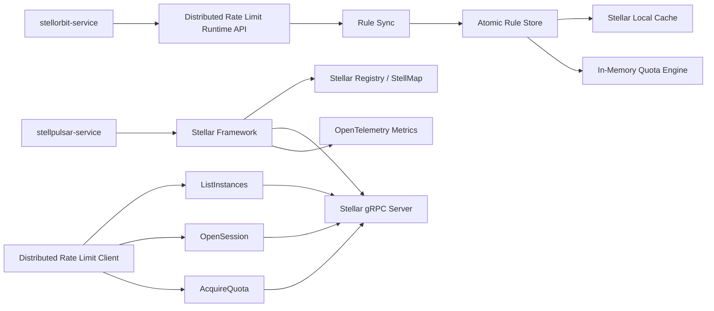

# StellPulsar Service

English | [简体中文](./README_CN.md)

`stellpulsar-service` is a lightweight distributed rate limiting server for the Stell ecosystem. It is designed for high-QPS traffic governance paths where low latency, local decisions, and bounded weak consistency are more important than globally serializable quota accounting.

StellPulsar keeps the published distributed rate limit rules in local memory, exposes a gRPC runtime protocol to clients, and uses topology-aware owner routing so a quota shard is normally handled by a single server instance within the same topology revision.

## Project Status

| Item | Value |
| --- | --- |
| Stability | Early development |
| Language | Go |
| Framework | [Stellar](https://github.com/stellhub/stellar) |
| Runtime API | gRPC |
| Rule source | `stellorbit-service` runtime APIs |
| Registry | Stellar registry adapter, normally backed by StellMap |
| Rule cache | Stellar local cache + atomic in-memory snapshot |
| Quota engine | In-memory fixed-window quota engine |
| Consistency model | Weak consistency, local-owner-single-writer |

## What StellPulsar Does

StellPulsar is a server-side runtime component for distributed rate limiting. It is not the rule authoring system and it is not an application-side SDK.

It is responsible for:

- Loading all published distributed rate limit rules from `stellorbit-service` at startup.
- Watching published rule changes and applying deltas into a full in-memory snapshot.
- Serving gRPC instance discovery, long-lived client sessions, quota acquisition, rule fetch, and rule validation.
- Keeping client-side rules and server-side rules comparable through `revision` and `checksum`.
- Maintaining a topology view of available StellPulsar instances.
- Rejecting quota requests that are sent to a non-owner server instance.
- Exposing topology OpenTelemetry metrics through Stellar observability.

It intentionally avoids a strong-consistency counter path in the hot quota request flow. The default design keeps quota decisions local to the owner instance and accepts bounded weak consistency as an operational trade-off.

## Architecture



## Core Runtime Flow

1. The service starts with Stellar and loads `cmd/application.yaml`.
2. The rule syncer pulls the full published snapshot from `stellorbit-service`.
3. The rule store builds an immutable in-memory snapshot and writes it to Stellar local cache.
4. The registry provider exposes current StellPulsar instances through the Stellar registry abstraction.
5. Clients call `ListInstances` and cache the topology revision plus hash algorithm.
6. Clients calculate the quota owner for each shard key and call `AcquireQuota` on that owner.
7. The server validates rule revision, checksum, topology revision, and target instance before deducting local quota.
8. Rule changes are watched through StellOrbit runtime APIs and pushed to connected clients through the bidirectional stream.

## gRPC API Surface

The protocol is defined in [`api/stellpulsar/v1/stellpulsar.proto`](./api/stellpulsar/v1/stellpulsar.proto).

| Service | RPC | Purpose |
| --- | --- | --- |
| `StellPulsarDiscoveryService` | `ListInstances` | Return all available server instances, topology revision, and hash algorithm. |
| `StellPulsarRuntimeService` | `OpenSession` | Maintain a bidirectional stream for hello, heartbeat, rule digest, and rule change notifications. |
| `StellPulsarRuntimeService` | `AcquireQuota` | Validate rule and topology metadata, then acquire quota from the local owner instance. |
| `StellPulsarRuntimeService` | `GetRuleSnapshot` | Return server-side runtime rules for selected applications and rule IDs. |
| `StellPulsarRuntimeService` | `ValidateRuleSnapshot` | Compare client rule digests with server rule digests. |

## Consistency Model

StellPulsar uses weak consistency by design.

The default consistency level is:

```text
local-owner-single-writer
```

This means:

- A quota shard is identified by `application_code + ":" + rule_id + ":" + quota_key`.
- Clients and servers use the same `topology_revision` and `rendezvous_hash_v1` algorithm.
- Only the calculated owner instance is allowed to deduct the local quota bucket.
- A non-owner instance returns `NOT_OWNER` with the expected owner metadata.
- During topology changes, short-term over-admission may happen within the documented weak-consistency boundary.
- If an owner instance crashes, in-memory bucket state for the current window is not recovered by default.

See [`docs/distributed-quota-consistency.md`](./docs/distributed-quota-consistency.md) for the detailed client/server contract.

## Rule Synchronization

`stellorbit-service` is the authority for published distributed rate limit rules. StellPulsar integrates with its runtime API:

| Runtime API | Usage |
| --- | --- |
| `GET /snapshot` | Pull a full paginated snapshot at startup or after an unrecoverable delta gap. |
| `GET /watch` | Watch published runtime changes through SSE. |
| `GET /changes` | Pull authoritative deltas after a watch event. |

The server keeps a last-known-good snapshot. If rule synchronization fails, the hot path continues to use the previous snapshot instead of mutating partially-applied rule state.

## Observability

StellPulsar uses Stellar observability and OpenTelemetry metrics. The default development configuration exposes Prometheus metrics at:

```text
GET /metrics
```

Topology-specific metrics include:

| Metric | Description |
| --- | --- |
| `stellpulsar.topology.refresh.count` | Topology refresh count grouped by result. |
| `stellpulsar.topology.refresh.duration` | Topology refresh duration. |
| `stellpulsar.topology.cache.access.count` | Topology cache hit, expired, and empty counts. |
| `stellpulsar.topology.cache.age` | Current topology cache age. |
| `stellpulsar.topology.cache.stale` | Whether stale topology fallback is active. |
| `stellpulsar.topology.instance.count` | Instance count grouped by state. |
| `stellpulsar.topology.owner.lookup.count` | Owner lookup count grouped by result. |
| `stellpulsar.topology.owner.lookup.duration` | Owner lookup duration. |
| `stellpulsar.topology.owner.check.count` | Server-side owner validation decisions. |

## Configuration

The default configuration lives in [`cmd/application.yaml`](./cmd/application.yaml).

Important sections:

| Section | Purpose |
| --- | --- |
| `grpc.server` | Enables the Stellar gRPC server. |
| `grpc.client` | Configures Stellar gRPC clients. |
| `cache` | Enables Stellar local cache for last-known-good rule snapshots. |
| `registry` | Configures service registration and discovery, normally through StellMap. |
| `stellpulsar.stellorbit` | Configures the StellOrbit runtime API endpoint and timeout. |
| `stellpulsar.rules` | Configures snapshot pagination, watch behavior, retry windows, and bucket limits. |
| `stellpulsar.observability` | Enables topology business metrics. |
| `opentelemetry` | Configures global OpenTelemetry export behavior. |

## Development

Run tests:

```bash
go test ./...
```

Run locally:

```bash
go run ./cmd --config ./cmd/application.yaml
```

Build locally:

```bash
go build -o stellpulsar-service ./cmd
```

## Release Artifacts

The repository includes a tag-triggered GitHub Actions release workflow:

```text
.github/workflows/release.yml
```

When a tag is pushed, the workflow builds and uploads:

| Platform | Artifact |
| --- | --- |
| Linux amd64 | `stellpulsar-service-linux-amd64.tar.gz` |
| Windows amd64 | `stellpulsar-service-windows-amd64.zip` |

Each package contains:

- `stellpulsar-service` or `stellpulsar-service.exe`
- `application.yaml`

## Documentation

- [`docs/ADR.md`](./docs/ADR.md): architecture decision record.
- [`docs/distributed-quota-consistency.md`](./docs/distributed-quota-consistency.md): distributed quota owner routing and weak-consistency contract.

## Roadmap

- Complete production-grade topology migration and drain behavior.
- Add readiness checks for rule snapshot health, registry availability, and topology freshness.
- Expand quota algorithms beyond the initial in-memory fixed-window engine.
- Add stronger security profiles such as mTLS or JWT-based client identity.
- Provide official client SDKs that implement the topology owner routing contract.

## License

The license will be defined before the first stable release.
