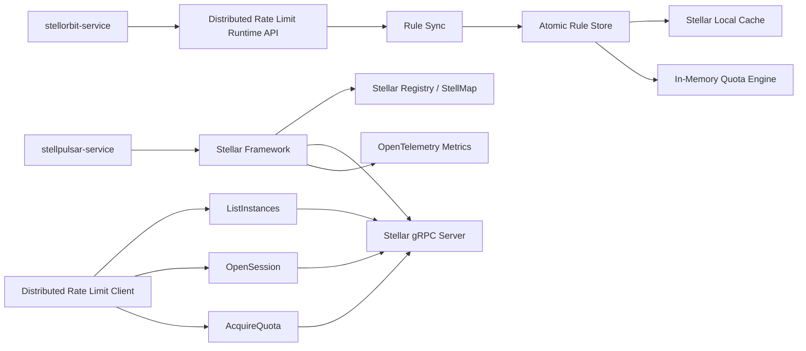

# StellPulsar Service

[English](./README.md) | 简体中文

`stellpulsar-service` 是 Stell 体系中的轻量级分布式限流服务端，面向高 QPS 流量治理场景。它优先保证低延迟、本地判定和可控弱一致性，而不是在配额请求热路径上追求全局强一致计数。

StellPulsar 会在本地内存中保存已经发布的分布式限流规则，通过 gRPC 向客户端提供运行时协议，并使用 topology owner 路由让同一个配额分片在同一个拓扑版本内尽量只由一个服务端实例处理。

## 项目状态

| 项目 | 内容 |
| --- | --- |
| 稳定性 | 早期开发 |
| 语言 | Go |
| 框架 | [Stellar](https://github.com/stellhub/stellar) |
| 运行时 API | gRPC |
| 规则来源 | `stellorbit-service` runtime APIs |
| 注册发现 | Stellar registry adapter，通常由 StellMap 提供后端 |
| 规则缓存 | Stellar local cache + atomic in-memory snapshot |
| 配额引擎 | 单机内存固定窗口配额引擎 |
| 一致性模型 | 弱一致，local-owner-single-writer |

## StellPulsar 负责什么

StellPulsar 是服务端运行时组件，不是规则编排系统，也不是应用侧 SDK。

它负责：

- 启动时从 `stellorbit-service` 拉取所有已经发布的分布式限流规则。
- 监听已经发布的规则变更，并把增量应用到完整内存快照。
- 通过 gRPC 提供实例发现、客户端长连接、配额获取、规则获取和规则校验。
- 通过 `revision` 与 `checksum` 让客户端规则和服务端规则可比较、可校验。
- 维护当前可用 StellPulsar 实例的 topology 视图。
- 拒绝被错误路由到非 owner 实例的配额请求。
- 通过 Stellar observability 暴露 topology OpenTelemetry 指标。

它不会在默认热路径中引入强一致远端计数器。默认设计让 owner 实例在本地完成配额判定，并把弱一致偏差控制在明确的工程边界内。

## 架构



## 核心运行流程

1. 服务通过 Stellar 启动，并读取 `cmd/application.yaml`。
2. 规则同步器从 `stellorbit-service` 拉取完整发布快照。
3. 规则存储构建不可变内存快照，并写入 Stellar local cache。
4. 注册中心 provider 通过 Stellar registry 抽象暴露当前 StellPulsar 实例。
5. 客户端调用 `ListInstances`，缓存 topology revision 和 hash algorithm。
6. 客户端为每个 shard key 计算 owner，并向 owner 实例调用 `AcquireQuota`。
7. 服务端先校验规则 revision、checksum、topology revision 和 target instance，再扣减本地配额。
8. 规则变化通过 StellOrbit runtime API watch，并通过双向流通知已连接客户端。

## gRPC API

协议定义在 [`api/stellpulsar/v1/stellpulsar.proto`](./api/stellpulsar/v1/stellpulsar.proto)。

| Service | RPC | 用途 |
| --- | --- | --- |
| `StellPulsarDiscoveryService` | `ListInstances` | 返回所有可用服务端实例、topology revision 和 hash algorithm。 |
| `StellPulsarRuntimeService` | `OpenSession` | 维护 hello、heartbeat、rule digest、rule changed 等双向流通信。 |
| `StellPulsarRuntimeService` | `AcquireQuota` | 校验规则和 topology 元数据，并在本地 owner 实例上获取配额。 |
| `StellPulsarRuntimeService` | `GetRuleSnapshot` | 返回服务端当前运行时规则内容。 |
| `StellPulsarRuntimeService` | `ValidateRuleSnapshot` | 对比客户端规则 digest 和服务端规则 digest。 |

## 一致性模型

StellPulsar 明确采用弱一致设计。

默认一致性级别是：

```text
local-owner-single-writer
```

含义如下：

- 配额分片由 `application_code + ":" + rule_id + ":" + quota_key` 标识。
- 客户端和服务端使用相同的 `topology_revision` 和 `rendezvous_hash_v1` 算法。
- 只有计算出的 owner 实例可以扣减本地 quota bucket。
- 非 owner 实例返回 `NOT_OWNER`，并带上期望 owner 元数据。
- topology 变化期间，系统允许短期有限超发。
- owner 实例异常宕机时，默认不恢复当前窗口内的本地内存 bucket 状态。

完整客户端与服务端契约见 [`docs/distributed-quota-consistency.md`](./docs/distributed-quota-consistency.md)。

## 规则同步

`stellorbit-service` 是已经发布的分布式限流规则的权威来源。StellPulsar 对接以下 runtime API：

| Runtime API | 用途 |
| --- | --- |
| `GET /snapshot` | 启动时或增量不可恢复时分页拉取完整快照。 |
| `GET /watch` | 通过 SSE 监听已经发布的运行时规则变化。 |
| `GET /changes` | 收到 watch 事件后拉取权威增量。 |

服务端保留 last-known-good 快照。规则同步失败时，热路径继续使用上一个完整快照，不会把部分应用成功的规则状态暴露给配额请求。

## 可观测性

StellPulsar 使用 Stellar observability 和 OpenTelemetry metrics。默认开发配置在以下地址暴露 Prometheus 指标：

```text
GET /metrics
```

topology 相关业务指标包括：

| 指标 | 说明 |
| --- | --- |
| `stellpulsar.topology.refresh.count` | topology 刷新次数，按结果分类。 |
| `stellpulsar.topology.refresh.duration` | topology 刷新耗时。 |
| `stellpulsar.topology.cache.access.count` | topology cache 命中、过期、空缓存次数。 |
| `stellpulsar.topology.cache.age` | 当前 topology cache 年龄。 |
| `stellpulsar.topology.cache.stale` | 是否正在使用 stale topology fallback。 |
| `stellpulsar.topology.instance.count` | 按状态统计的实例数量。 |
| `stellpulsar.topology.owner.lookup.count` | owner lookup 次数，按结果分类。 |
| `stellpulsar.topology.owner.lookup.duration` | owner lookup 耗时。 |
| `stellpulsar.topology.owner.check.count` | 服务端 owner 校验结果。 |

## 配置

默认配置位于 [`cmd/application.yaml`](./cmd/application.yaml)。

关键配置段：

| 配置段 | 用途 |
| --- | --- |
| `grpc.server` | 启用 Stellar gRPC server。 |
| `grpc.client` | 配置 Stellar gRPC client。 |
| `cache` | 启用 Stellar local cache，保存 last-known-good 规则快照。 |
| `registry` | 配置服务注册发现，通常接入 StellMap。 |
| `stellpulsar.stellorbit` | 配置 StellOrbit runtime API 地址和超时。 |
| `stellpulsar.rules` | 配置快照分页、watch、重试窗口和 bucket 限制。 |
| `stellpulsar.observability` | 启用 topology 业务指标。 |
| `opentelemetry` | 配置全局 OpenTelemetry 导出行为。 |

## 开发

运行测试：

```bash
go test ./...
```

本地启动：

```bash
go run ./cmd --config ./cmd/application.yaml
```

本地构建：

```bash
go build -o stellpulsar-service ./cmd
```

## 发布产物

仓库包含 tag 触发的 GitHub Actions release workflow：

```text
.github/workflows/release.yml
```

推送 tag 后会构建并上传以下产物：

| 平台 | 产物 |
| --- | --- |
| Linux amd64 | `stellpulsar-service-linux-amd64.tar.gz` |
| Windows amd64 | `stellpulsar-service-windows-amd64.zip` |

每个发布包都包含：

- `stellpulsar-service` 或 `stellpulsar-service.exe`
- `application.yaml`

## 文档

- [`docs/ADR.md`](./docs/ADR.md)：架构设计决策。
- [`docs/distributed-quota-consistency.md`](./docs/distributed-quota-consistency.md)：分布式配额 owner 路由和弱一致契约。

## Roadmap

- 完善生产级 topology migration 和 drain 行为。
- 增加规则快照健康、注册中心可用性和 topology 新鲜度 readiness 检查。
- 在初始内存固定窗口引擎之外扩展更多限流算法。
- 增加 mTLS 或 JWT 客户端身份等更强安全配置。
- 提供实现 topology owner 路由契约的官方客户端 SDK。

## License

首个稳定版本发布前会明确 license。
