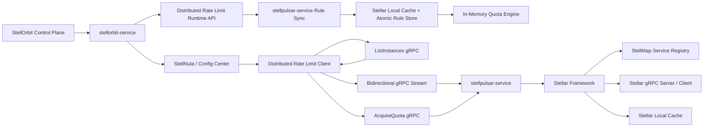

# ADR: StellPulsar 分布式限流服务端架构设计

## 状态

Proposed

## 日期

2026-06-18

## 问题分析

`stellpulsar-service` 是 Stell 体系里的轻量级分布式限流服务端。它不负责规则编排、规则发布和配置中心存储，而是负责在运行时持有所有已发布限流规则，并为分布式限流客户端提供低延迟配额获取、规则版本校验、实例发现和长连接同步能力。

当前边界如下：

1. `stellorbit-service` 是限流规则的权威发布端。它负责限流规则的保存、校验、发布、回滚和运行时读取，并把最终运行时快照发布到配置中心。
2. `DistributedRateLimitRuleRuntimeController` 已经为分布式限流服务端提供运行时读取 API：启动时通过 `/snapshot` 分页全量拉取，运行期通过 `/watch` 监听变化，有增量时再通过 `/changes` 拉取权威增量。
3. `stellar` 是当前服务端的应用框架。`stellpulsar-service` 通过 Stellar 接入服务注册中心、gRPC server、gRPC client、单机 cache 和可观测能力，不在业务代码中直接维护 gRPC server 或直接调用 StellMap SDK。
4. 分布式限流客户端会同时从配置中心拿到规则，也会和 `stellpulsar-service` 建立 gRPC 通信。因此客户端本地规则版本、服务端内存规则版本、StellOrbit 发布版本必须可比较、可校验、可追踪。

关键挑战是规则传播的时间差。StellOrbit 通过配置中心下发到业务客户端的时间点，与 `stellpulsar-service` watch 到同一批限流规则的时间点必须尽量接近。如果客户端已经按新规则请求配额，而服务端仍停留在旧规则，可能出现误拒绝、误放行或配额维度不一致。

因此本 ADR 的核心目标是：

1. 启动时拉取全量已发布限流规则。
2. 运行期 watch 已发布限流规则，并以全量单机内存快照保存。
3. 通过 gRPC 定义客户端和服务端协议，覆盖实例发现、固定连接、心跳、配额获取、规则获取和规则校验。
4. 通过规则 `revision/checksum` 消除客户端和服务端对同一规则理解不一致的问题。
5. 通过实例优先级和客户端固定哈希降低热点节点风险。

## 设计

### 架构决策

`stellpulsar-service` 采用“控制面规则同步 + 数据面配额判定”的单进程架构：



服务端内部划分为以下模块：

| 模块 | 职责 |
| --- | --- |
| `app` | 作为 Stellar starter，组合配置、cache、registry、gRPC API、规则同步和 quota engine。 |
| `registry` | 通过 Stellar `ServiceRegistry` 查询实例；注册、心跳续约和注销由 Stellar registry starter 根据 `application.yaml` 统一处理。 |
| `rulesync` | 对接 `stellorbit-service` 分布式限流运行时 API，启动时分页全量拉取 `/snapshot`，运行期监听 `/watch`，有增量时拉取 `/changes`。 |
| `rulestore` | 使用 Stellar 单机 cache 保存规则快照，同时保留 atomic snapshot 做低延迟读路径，更新时整体替换。 |
| `quota` | 基于规则快照执行令牌桶、固定窗口、滑动窗口等内存配额扣减。 |
| `grpcapi` | 通过 Stellar gRPC server 注册实例发现、双向流、配额获取、规则获取和规则校验协议。 |
| `session` | 维护客户端长连接、心跳、规则 digest、服务端主动规则通知和断线清理。 |

### Stellar Framework 接入决策

当前服务端按 Stellar 示例模式启动：`cmd/main.go` 只调用 `stellar.Run(stellar.WithStarter(...))`，所有业务接线放在 `internal/app` starter 中完成。

Stellar 接入边界如下：

| 能力 | 接入方式 | 说明 |
| --- | --- | --- |
| 服务注册 | `application.yaml` 的 `registry` 段 + Stellar registry starter | 使用 `adapter: stellmap` 注册当前 gRPC endpoint，生命周期由 Stellar 负责。 |
| 服务发现 | `app.ServiceRegistry().Discover(...)` | `ListInstances` 不直接调用 StellMap SDK，而是通过 Stellar 注册中心抽象查询。 |
| gRPC server | `app.RPC().Register(...)` | proto 生成的两个 service descriptor 注册到 Stellar gRPC server。 |
| gRPC client | `application.yaml` 的 `grpc.client` 段 + `app.NewGRPCClient(...)` | starter 可按 `stellpulsar.grpc.client_name` 初始化 Stellar gRPC client；当前配置提供 `stellpulsar-self` 作为本地自连接样例。 |
| 单机缓存 | `app.Cache()` | 规则全量快照写入 Stellar local cache，进程内热读仍使用 atomic snapshot。 |
| 配置 | `application.yaml` | Stellar 标准段负责 app/grpc/cache/registry；`stellpulsar` 段负责 Runtime API 和规则同步参数。 |

### 服务注册与实例优先级

`stellpulsar-service` 启动后注册到 StellMap，推荐注册服务名为 `stellpulsar-service`，并至少暴露一个 `grpc` endpoint。

实例 metadata 需要包含：

| 字段 | 示例 | 说明 |
| --- | --- | --- |
| `instance_id` | `pulsar-10.0.1.11-9090` | 当前实例唯一 ID。 |
| `grpc_host` | `10.0.1.11` | 客户端访问 gRPC 的地址。 |
| `grpc_port` | `9090` | 客户端访问 gRPC 的端口。 |
| `priority` | `100` | 实例优先级，数值越小优先级越高。 |
| `weight` | `100` | 同优先级内的权重。 |
| `zone` | `az-a` | 可用区或机房。 |
| `version` | `v0.1.0` | 服务端版本。 |
| `rule_revision` | `20260618113000001` | 当前已应用的全局规则水位。 |

客户端首次调用 `ListInstances` 获取所有可用 `stellpulsar-service` 实例。返回结果按以下规则排序：

1. `priority` 升序。
2. 同优先级内按健康状态、`weight`、`instance_id` 排序。
3. 客户端优先在最高优先级健康实例集合内做一致性哈希。
4. 当最高优先级集合不可用时，降级到下一优先级集合。

这样服务端可以通过配置某些实例的优先级和权重，把热点客户端或热点 key 从高压节点迁移出去。

### 客户端固定哈希连接

客户端拿到实例列表后，不做随机连接，而是使用稳定哈希固定到目标服务端。

默认 hash key：

```text
application_code + ":" + client_id
```

配额请求的 shard key：

```text
application_code + ":" + rule_id + ":" + quota_key
```

连接策略：

1. 每个客户端进程使用 `application_code + client_id` 固定选择一个主连接实例。
2. 每次配额请求可以继续使用主连接实例；如果后续需要按限流 key 分片，可以升级为按 `rule_id + quota_key` 选择实例。
3. 客户端与选中实例建立 gRPC 双向流，用于心跳、规则 digest 上报、服务端规则变更通知和 drain 通知。
4. 当实例列表 revision 变化时，客户端重新计算 hash，只迁移受影响的 key 或连接。
5. 迁移期间保留短暂的旧连接 drain 窗口，避免瞬时断流。

### StellOrbit Runtime API 对接

`rulesync` 以 `stellorbit-service` 的运行时 API 作为分布式限流规则的服务端权威来源。

基础路径：

```text
/api/stellorbit/runtime/distributed-rate-limits
```

需要对接的接口：

| 接口 | 用途 | 关键参数 | 关键响应 |
| --- | --- | --- | --- |
| `GET /snapshot` | 分页拉取所有应用的分布式限流规则快照。 | `page`、`size` | `snapshotVersion`、`checksum`、`generatedAt`、`totalApplications`、`totalRules`、`configs`。 |
| `GET /watch` | SSE 监听分布式限流规则快照变化。 | `currentSnapshotVersion`、`currentChecksum` | `WATCH_HEARTBEAT`、`DELTA_CHANGED`、`FULL_SYNC_REQUIRED`。 |
| `GET /changes` | 按当前本地水位拉取规则增量。 | `currentSnapshotVersion`、`currentChecksum` | `fromSnapshotVersion`、`toSnapshotVersion`、`fromChecksum`、`toChecksum`、`changeCount`、`changes`。 |
| `GET /cache/telemetry` | 诊断 StellOrbit 侧运行时缓存状态。 | 无 | Caffeine 缓存指标。 |

`/snapshot` 响应中的 `configs.content` 与配置中心下发内容一致。`stellpulsar-service` 必须以 `content` 作为规则解析输入，以 `configId`、`applicationCode`、`checksum`、`aggregateChecksum` 和 `ruleCount` 作为规则身份和一致性校验字段。

`/watch` 只作为变化通知和水位提示，不直接作为本地规则快照的唯一写入来源。收到 `DELTA_CHANGED` 后，服务端必须使用当前本地 `snapshotVersion/checksum` 再调用 `/changes` 拉取权威增量；收到 `FULL_SYNC_REQUIRED` 或发现本地水位过旧时，必须重新执行 `/snapshot` 分页全量同步。

### 规则同步与内存快照

服务端启动流程：

1. `stellar.Run(...)` 读取 `application.yaml`，初始化 cache、registry、gRPC server、gRPC client 和 observability。
2. `internal/app` starter 在 `Init` 阶段从 `app.Cache()` 绑定 Stellar local cache，从 `app.ServiceRegistry()` 绑定 Stellar 注册中心，并通过 `app.RPC().Register(...)` 注册 gRPC service。
3. starter 初始化 StellOrbit Runtime API HTTP 客户端，配置 base URL、超时、分页大小和 watch 重连策略。
4. starter 在 `Start` 阶段调用 `/snapshot?page=0&size={snapshotPageSize}` 获取第一页，记录 `snapshotVersion`、`checksum`、`totalPages`。
5. 继续分页拉取剩余页面，直到 `page + 1 == totalPages`。
6. 校验所有分页响应的 `snapshotVersion/checksum` 必须一致；如果分页期间水位变化，丢弃本轮结果并从 page 0 重试，重试次数由 `stellpulsar.rules.full_sync_max_retries` 控制。
7. 解析每条 `configs.content`，校验 `configId`、`applicationCode`、`checksum`、`aggregateChecksum`、`ruleCount`、schema 和规则类型。
8. 构建全量不可变内存快照，写入 Stellar local cache，并记录 `snapshotVersion/checksum` 作为全局规则水位。
9. Stellar registry transport 根据 `application.yaml` 注册当前 `stellpulsar-service` gRPC 实例并维持心跳。
10. Stellar gRPC transport 启动服务端，starter 启动 `/watch` SSE 监听。

如果启动阶段 Runtime API 不可用，且 `stellpulsar.rules.allow_empty_startup=true`，服务端优先使用 Stellar local cache 中的 last-known-good 快照继续启动；只有本地没有任何可用快照时才允许以空规则快照启动。该模式必须配合 readiness、告警和规则同步 lag 指标使用，避免长期运行在空规则状态。

运行期 watch 流程：

1. 使用当前本地 `snapshotVersion/checksum` 调用 `/watch`。
2. 收到 `WATCH_HEARTBEAT` 时，只更新 watch 健康时间和 StellOrbit 最新水位观测值。
3. 收到 `DELTA_CHANGED` 时，调用 `/changes?currentSnapshotVersion={localVersion}&currentChecksum={localChecksum}` 拉取增量。
4. 校验 `/changes` 的 `fromSnapshotVersion/fromChecksum` 必须等于本地水位。
5. 根据每条 change 的 `operation` 对本地候选快照执行 upsert/delete。
6. 校验 `changeCount`、`fromSnapshotVersion`、`toSnapshotVersion`、`fromChecksum`、`toChecksum`、`previousChecksum`、`currentChecksum` 等可证明字段；如果未来 StellOrbit 暴露快照 checksum 计算规范，服务端再补充本地重算最终 checksum 的强校验。
7. 校验通过后 atomic 替换为新快照，并写入 Stellar local cache；cache 写入失败需要向同步流程返回错误。
8. 收到 `FULL_SYNC_REQUIRED`、增量不连续、checksum 不匹配、change 解析失败或 watch 断开超过阈值时，重新执行分页全量同步。
9. watch 事件进入有界缓冲队列，业务处理慢时优先断开并重连，避免 SSE reader 被长时间阻塞。
10. 周期性全量校验需要能主动取消当前长 SSE 连接，保证 `watch_resync_interval` 在长连接不关闭时也能生效。

规则快照结构建议：

```text
RuleSnapshot
  snapshot_version
  snapshot_checksum
  generated_at_unix_ms
  applications[application_code]
    snapshot_version
    checksum
    configs[config_id]
      aggregate_checksum
      content_checksum
      rule_count
      rules[rule_id]
        rule_type = distributed_rate_limit
        scope
        algorithm
        dimensions
        quota
        window
        fail_policy
```

更新规则时，`rulesync` 不在原 map 上原地修改，而是基于全量分页结果或 `/changes` 增量结果构建新的 `RuleSnapshot`，校验通过后通过 atomic pointer 一次性替换，并把完整快照序列化写入 Stellar local cache。任何 watch 事件如果无法解析、增量不连续、校验失败、checksum 不匹配、cache 写入失败或缺少必要字段，都必须保留 last-known-good 快照，并记录错误指标。

规则 store 需要支持订阅通知。gRPC 长连接、实例本地规则水位刷新等运行期组件通过订阅同一个快照变更事件工作，避免各模块自行轮询。

### 规则传播一致性

客户端和服务端必须围绕同一组字段做一致性判断：

| 字段 | 说明 |
| --- | --- |
| `application_code` | 应用编码。 |
| `rule_id` | 限流规则 ID。 |
| `revision` | StellOrbit 发布版本或配置中心 revision。 |
| `checksum` | 规则内容摘要。 |
| `schema_version` | 运行时规则 schema。 |

客户端发起配额请求时必须携带它本地看到的 `rule_revision` 和 `rule_checksum`。服务端处理策略：

1. 完全一致：正常扣减配额。
2. 请求缺少 `application_code`、`rule_id`、`quota_key`、`rule_revision` 或 `rule_checksum`：返回 `INVALID_REQUEST`，不执行扣减。
3. 服务端版本更新：返回 `RULE_STALE`，并在响应中带上服务端 revision/checksum；客户端应尽快更新本地规则。
4. 客户端版本更新但服务端尚未 watch 到：返回 `SERVER_RULE_LAG`，并给出 `retry_after_ms`。客户端可以短暂重试，也可以按自身本地 fail policy 降级。
5. checksum 不一致：返回 `RULE_CONFLICT`，客户端应调用 `ValidateRuleSnapshot` 或 `GetRuleSnapshot` 对齐内容。
6. 服务端没有对应规则：返回 `RULE_NOT_FOUND`，客户端按规则兜底策略处理。

推荐配置：

| 配置项 | 默认值 | 说明 |
| --- | --- | --- |
| `rules.maxPropagationSkewMs` | `2000` | 客户端规则下发和服务端 watch 的最大可接受时间差。 |
| `rules.serverLagRetryAfterMs` | `50` | 服务端规则滞后时建议客户端重试间隔。 |
| `rules.compatiblePreviousRevisionMs` | `5000` | 允许旧 revision 短暂继续判定的窗口。 |
| `rules.snapshotPageSize` | `100` | 调用 `/snapshot` 时的分页大小，默认与 StellOrbit API 默认值保持一致。 |
| `rules.watchReconnectDelayMs` | `500` | `/watch` 正常完成或异常断开后的初始重连延迟。 |
| `rules.watchResyncIntervalSeconds` | `30` | watch 异常或增量无法连续应用时的全量重拉周期。 |
| `rules.deltaFetchTimeoutMs` | `3000` | 收到 `DELTA_CHANGED` 后调用 `/changes` 的超时时间。 |
| `rules.fullSyncMaxRetries` | `3` | `/snapshot` 分页期间水位变化时的最大重试次数。 |
| `rules.watchEventBuffer` | `64` | watch 事件处理缓冲区大小。 |
| `rules.bucketGCIntervalMs` | `30000` | 单机配额桶过期清理间隔。 |
| `rules.expiredBucketGraceMs` | `120000` | 窗口重置后保留过期桶的宽限时间。 |
| `rules.maxBuckets` | `1000000` | 单实例最大内存配额桶数量。 |

### gRPC 交互协议

协议拆分为四类能力：

1. `ListInstances`：客户端首次获取所有 `stellpulsar-service` 实例。
2. `OpenSession`：客户端与固定服务端建立双向流，做心跳、规则 digest 上报和服务端通知。
3. `AcquireQuota`：客户端请求获取配额。
4. `GetRuleSnapshot` / `ValidateRuleSnapshot`：客户端获取服务端规则内容或校验双方规则是否一致。

完整 proto 草案如下：

```proto
syntax = "proto3";

package stellpulsar.v1;

option go_package = "github.com/stellhub/stellpulsar-service/api/stellpulsar/v1;stellpulsarv1";

service StellPulsarDiscoveryService {
  rpc ListInstances(ListInstancesRequest) returns (ListInstancesResponse);
}

service StellPulsarRuntimeService {
  rpc OpenSession(stream ClientFrame) returns (stream ServerFrame);
  rpc AcquireQuota(AcquireQuotaRequest) returns (AcquireQuotaResponse);
  rpc GetRuleSnapshot(GetRuleSnapshotRequest) returns (GetRuleSnapshotResponse);
  rpc ValidateRuleSnapshot(ValidateRuleSnapshotRequest) returns (ValidateRuleSnapshotResponse);
}

message ListInstancesRequest {
  string namespace = 1;
  string application_code = 2;
  string client_id = 3;
  repeated string supported_protocol_versions = 4;
  map<string, string> labels = 5;
}

message ListInstancesResponse {
  string protocol_version = 1;
  string instance_revision = 2;
  int64 expires_at_unix_ms = 3;
  repeated PulsarInstance instances = 4;
}

message PulsarInstance {
  string instance_id = 1;
  string host = 2;
  int32 port = 3;
  int32 priority = 4;
  int32 weight = 5;
  string zone = 6;
  string version = 7;
  string rule_revision = 8;
  string state = 9;
  map<string, string> metadata = 10;
}

message ClientFrame {
  string session_id = 1;
  string client_id = 2;
  string application_code = 3;
  oneof payload {
    ClientHello hello = 10;
    ClientHeartbeat heartbeat = 11;
    ClientRuleDigest rule_digest = 12;
    ClientAck ack = 13;
  }
}

message ServerFrame {
  string session_id = 1;
  string server_instance_id = 2;
  oneof payload {
    ServerHello hello = 10;
    ServerHeartbeat heartbeat = 11;
    ServerRuleChanged rule_changed = 12;
    ServerDrain drain = 13;
    ServerError error = 14;
  }
}

message ClientHello {
  string protocol_version = 1;
  string sdk_version = 2;
  string application_code = 3;
  string client_id = 4;
  string selected_instance_id = 5;
  repeated RuleDigest rule_digests = 6;
}

message ServerHello {
  string protocol_version = 1;
  string server_instance_id = 2;
  string global_rule_revision = 3;
  repeated RuleDigest rule_digests = 4;
  int64 heartbeat_interval_ms = 5;
}

message ClientHeartbeat {
  int64 sent_at_unix_ms = 1;
  string last_seen_server_rule_revision = 2;
}

message ServerHeartbeat {
  int64 sent_at_unix_ms = 1;
  string global_rule_revision = 2;
}

message ClientRuleDigest {
  repeated RuleDigest rule_digests = 1;
}

message ServerRuleChanged {
  string global_rule_revision = 1;
  repeated RuleDigest changed_rules = 2;
  bool requires_client_resync = 3;
}

message ClientAck {
  string ack_id = 1;
  string ack_type = 2;
  string revision = 3;
  string message = 4;
}

message ServerDrain {
  string reason = 1;
  int64 deadline_unix_ms = 2;
  repeated PulsarInstance preferred_instances = 3;
}

message ServerError {
  string code = 1;
  string message = 2;
  int64 retry_after_ms = 3;
}

message AcquireQuotaRequest {
  string request_id = 1;
  string application_code = 2;
  string client_id = 3;
  string rule_id = 4;
  string quota_key = 5;
  int64 cost = 6;
  string rule_revision = 7;
  string rule_checksum = 8;
  map<string, string> attributes = 9;
}

message AcquireQuotaResponse {
  string request_id = 1;
  QuotaDecision decision = 2;
  string rule_id = 3;
  string rule_revision = 4;
  string rule_checksum = 5;
  int64 remaining = 6;
  int64 reset_at_unix_ms = 7;
  int64 retry_after_ms = 8;
  string reason = 9;
}

message GetRuleSnapshotRequest {
  string application_code = 1;
  repeated string rule_ids = 2;
  string known_revision = 3;
}

message GetRuleSnapshotResponse {
  string application_code = 1;
  string revision = 2;
  string checksum = 3;
  repeated RateLimitRule rules = 4;
}

message ValidateRuleSnapshotRequest {
  string application_code = 1;
  repeated RuleDigest rule_digests = 2;
}

message ValidateRuleSnapshotResponse {
  string application_code = 1;
  RuleValidationStatus status = 2;
  repeated RuleValidationResult results = 3;
}

message RuleDigest {
  string application_code = 1;
  string rule_id = 2;
  string revision = 3;
  string checksum = 4;
  string schema_version = 5;
}

message RuleValidationResult {
  RuleDigest client_digest = 1;
  RuleDigest server_digest = 2;
  RuleValidationStatus status = 3;
  string message = 4;
}

message RateLimitRule {
  string application_code = 1;
  string rule_id = 2;
  string name = 3;
  string revision = 4;
  string checksum = 5;
  string schema_version = 6;
  string algorithm = 7;
  int64 quota = 8;
  int64 window_seconds = 9;
  int64 burst = 10;
  repeated string dimensions = 11;
  string fail_policy = 12;
  map<string, string> attributes = 13;
}

enum QuotaDecision {
  QUOTA_DECISION_UNSPECIFIED = 0;
  QUOTA_DECISION_ALLOWED = 1;
  QUOTA_DECISION_DENIED = 2;
  QUOTA_DECISION_RULE_STALE = 3;
  QUOTA_DECISION_SERVER_RULE_LAG = 4;
  QUOTA_DECISION_RULE_CONFLICT = 5;
  QUOTA_DECISION_RULE_NOT_FOUND = 6;
  QUOTA_DECISION_INVALID_REQUEST = 7;
  QUOTA_DECISION_NOT_OWNER = 8;
  QUOTA_DECISION_SHARD_MIGRATING = 9;
}

enum RuleValidationStatus {
  RULE_VALIDATION_STATUS_UNSPECIFIED = 0;
  RULE_VALIDATION_STATUS_MATCHED = 1;
  RULE_VALIDATION_STATUS_CLIENT_STALE = 2;
  RULE_VALIDATION_STATUS_SERVER_STALE = 3;
  RULE_VALIDATION_STATUS_CONFLICT = 4;
  RULE_VALIDATION_STATUS_NOT_FOUND = 5;
}
```

### 配额判定模型

第一阶段使用单机内存配额引擎：

1. 每个 `rule_id + quota_key` 对应一个本地计数器或令牌桶。
2. 客户端通过固定哈希把同一类 key 稳定打到同一实例。
3. 服务端只在本地执行扣减，不走跨节点共识。
4. 当实例宕机或重新分片时，短期配额可能出现弱一致偏差。
5. 规则版本不一致时，配额判定优先返回规则状态错误，不盲目扣减。
6. 单机内存桶必须有过期清理和最大桶数保护，避免高基数 `quota_key` 导致进程内存无界增长。

这与项目定位一致：优先保证低延迟、可用性和故障隔离，接受有限的弱一致偏差。

多节点部署时，客户端和服务端必须进一步遵守 [Distributed Quota Consistency Design](./distributed-quota-consistency.md)。该文档把 `instance_revision` 收敛为 `topology_revision`，要求客户端和服务端使用同一套 owner 计算算法，并在服务端侧强制执行 owner 校验；在该契约落地前，当前单机内存配额模型不能宣称已经解决跨节点配额一致性。

### 故障与降级策略

| 场景 | 服务端行为 | 客户端行为 |
| --- | --- | --- |
| StellOrbit 全量拉取失败 | 优先使用 Stellar local cache 中的 last-known-good；无缓存且允许空启动时才使用空规则快照。 | 不适用。 |
| `/snapshot` 分页期间水位变化 | 丢弃本轮分页结果，从 page 0 重新全量同步。 | 不适用。 |
| `/watch` 断开 | 保留 last-known-good，带最新本地水位按退避重连。 | 长连接收到规则水位不变。 |
| `/changes` 增量不连续 | 不应用增量，重新执行分页全量同步。 | 可能短暂收到 `SERVER_RULE_LAG`。 |
| 客户端规则领先服务端 | 返回 `SERVER_RULE_LAG`。 | 短暂重试或按 fail policy 降级。 |
| 服务端规则领先客户端 | 返回 `RULE_STALE` 并推送规则变更通知。 | 重新从配置中心或服务端拉取规则。 |
| gRPC 长连接断开 | 清理 session，保留配额状态。 | 根据实例列表重新 hash 连接。 |
| 节点 drain | 通过 stream 下发 `ServerDrain`。 | 在 deadline 前迁移到新实例。 |

### 安全边界

生产环境必须限制 Runtime API 和 gRPC API 的访问面：

1. `stellorbit` Runtime API 调用支持配置 Bearer token，用于接入已有网关、服务端 token 校验或内网访问控制。
2. `stellpulsar` gRPC API 支持可选 shared token metadata 校验；未配置 token 时保持本地开发便利性。
3. shared token 只作为最低限度的接入保护，企业生产仍应优先使用 mTLS、JWT、服务网格或 API Gateway ACL 做客户端身份认证和授权。
4. `GetRuleSnapshot`、`ValidateRuleSnapshot` 等诊断接口与 `AcquireQuota` 使用同一鉴权边界，避免规则内容被未授权客户端读取。

### 可观测性

必须提供以下指标：

| 指标 | 说明 |
| --- | --- |
| `stellpulsar_rule_snapshot_revision` | 当前内存规则水位。 |
| `stellpulsar_rule_snapshot_checksum` | 当前内存规则 checksum。 |
| `stellpulsar_rule_snapshot_full_sync_total` | 分页全量同步次数。 |
| `stellpulsar_rule_delta_apply_total` | 增量拉取和应用次数。 |
| `stellpulsar_rule_watch_lag_ms` | 服务端 watch 到规则的延迟。 |
| `stellpulsar_rule_conflict_total` | 客户端和服务端规则 checksum 冲突次数。 |
| `stellpulsar_quota_request_total` | 配额请求总数。 |
| `stellpulsar_quota_decision_total` | 按 decision 统计的配额结果。 |
| `stellpulsar_session_active` | 当前活跃 gRPC stream 数。 |
| `stellpulsar_instance_priority` | 当前实例优先级。 |
| `stellpulsar.topology.refresh.count` | topology 从注册中心刷新实例视图的次数，按 `result` 区分 `success`、`error` 和 `stale_cache`。 |
| `stellpulsar.topology.refresh.duration` | topology 刷新注册中心实例视图的耗时。 |
| `stellpulsar.topology.cache.access.count` | topology cache 访问次数，按 `result` 区分 `hit`、`expired`、`empty`。 |
| `stellpulsar.topology.cache.age` | 当前 topology cache 快照年龄。 |
| `stellpulsar.topology.cache.stale` | 当前 topology cache 是否处于 stale fallback 状态。 |
| `stellpulsar.topology.instance.count` | 当前 topology 中按 `state` 统计的实例数量。 |
| `stellpulsar.topology.owner.lookup.count` | owner 计算次数，按 `result` 区分成功、失败和无 owner。 |
| `stellpulsar.topology.owner.lookup.duration` | owner 计算耗时。 |
| `stellpulsar.topology.owner.check.count` | 服务端 owner 校验结果，按 `result` 和 `reason` 统计 not-owner、revision mismatch、target mismatch、owner matched 等情况。 |

日志需要包含 `request_id`、`client_id`、`application_code`、`rule_id`、`revision`、`checksum` 和 `decision`，但不能打印敏感 token 或完整业务身份明文。

## Implementation

落地顺序建议：

1. 新增 `api/stellpulsar/v1/stellpulsar.proto`，生成 Go gRPC 代码。
2. 新增 `application.yaml`，使用 Stellar 标准配置打开 `grpc.server`、`grpc.client`、`cache`、`registry`，并使用 `stellpulsar` 段承载 Runtime API 和规则同步参数。
3. 接入 Stellar starter，入口使用 `stellar.Run(stellar.WithStarter(...))`，由 Stellar 管理 gRPC server、registry 生命周期和 local cache。
4. 接入 `stellorbit-service` 分布式限流 Runtime API，完成 `/snapshot` 分页全量同步、`/watch` SSE 监听、`/changes` 增量拉取、checksum 校验和 atomic snapshot。
5. 实现 `ListInstances`，返回带 priority/weight 的服务端实例列表。
6. 实现 `OpenSession`，支持 hello、heartbeat、rule digest、rule changed 和 drain。
7. 实现 `AcquireQuota`，先覆盖内存令牌桶或固定窗口。
8. 实现 `GetRuleSnapshot` 和 `ValidateRuleSnapshot`。
9. 使用 Stellar observability 覆盖 cache、registry、gRPC server/client 的基础 trace/metrics/logs；业务侧再补规则传播延迟、规则冲突、配额判定和 gRPC session 的指标。
10. 增加单元测试和本地集成测试，覆盖规则一致、客户端领先、服务端领先、checksum 冲突和实例优先级排序。

## Complete Code

第一份完整可运行代码应从 proto 合同、Stellar starter 和规则同步骨架开始，最小闭环为：

1. `go test ./...` 可通过。
2. `go run ./cmd` 能通过 Stellar 启动 gRPC 服务。
3. 服务启动后能通过 Stellar registry starter 注册到 StellMap。
4. 服务启动后能通过 StellOrbit Runtime API 的 `/snapshot` 分页构建空快照或真实快照。
5. 测试客户端能调用 `ListInstances`、`OpenSession`、`AcquireQuota`、`GetRuleSnapshot` 和 `ValidateRuleSnapshot`。
6. 规则快照能写入 Stellar local cache，服务重启时可从 cache 读取 last-known-good 快照。

本 ADR 中的 proto 草案即后续实现的协议基线。后续代码实现必须保持字段语义兼容；如果需要删除字段、改变 enum 语义或改变 hash key，必须新增 ADR 或更新本 ADR。
