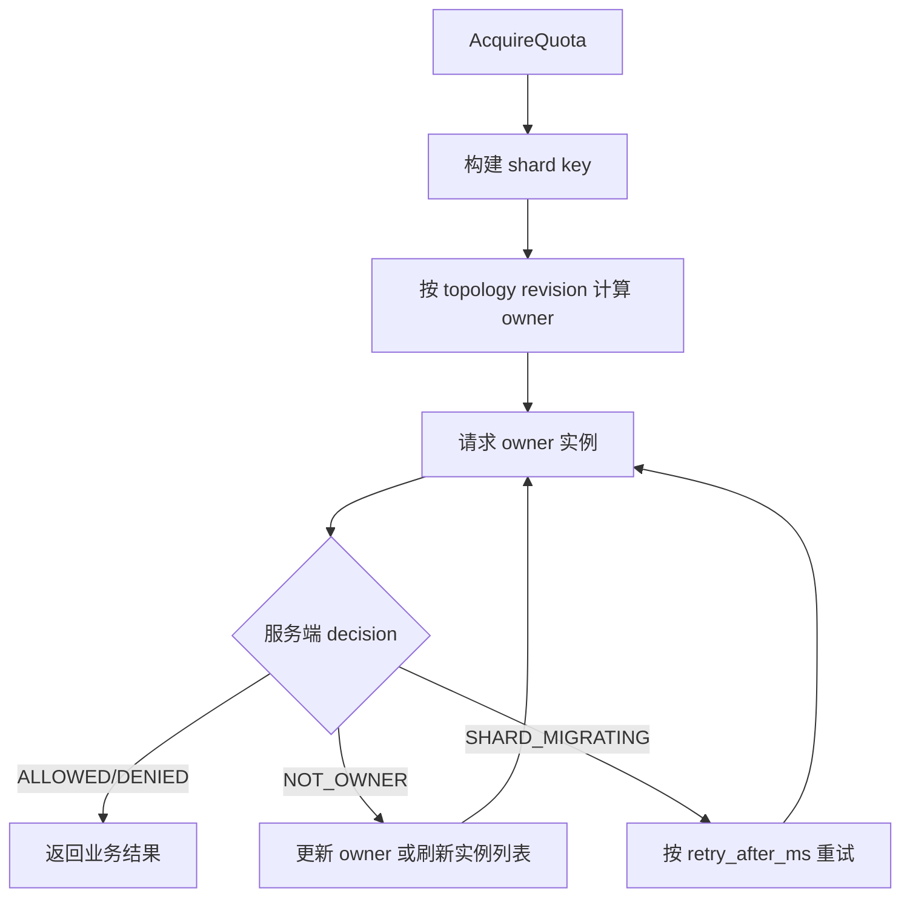
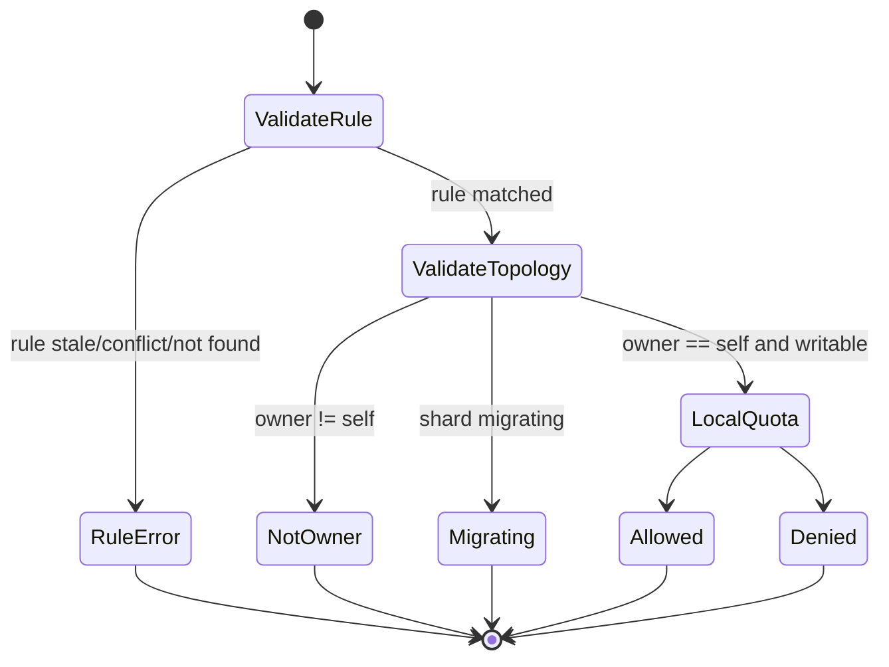
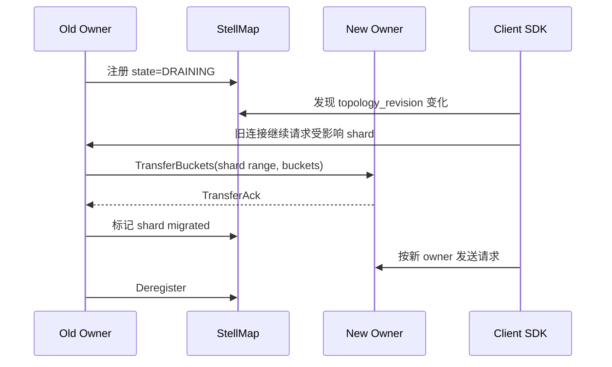

# Distributed Quota Consistency Design

## Problem Analysis

`stellpulsar-service` 当前使用单机内存桶执行配额扣减。这个模型在单节点内可以保证同一个窗口不超发，但在多节点部署时会出现跨节点一致性问题：

1. 客户端和服务端看到的实例列表可能不同，导致同一个 `quota_key` 被打到不同节点。
2. 节点上下线或权重调整会改变 hash 结果，旧 owner 和新 owner 可能同时扣减。
3. 节点异常宕机时，本地内存桶状态丢失，当前窗口可能被重置。
4. 客户端只按本地实例列表 hash，服务端不校验 owner 时，错误路由不会被发现。

因此跨节点配额一致性的核心不是让所有节点共同写同一个计数器，而是先保证同一个 shard key 在同一个拓扑版本下只有一个写入 owner。强一致计数后端作为可选模式补充给高价值、低容忍误差的规则。

## Design

### 一致性目标

| 目标 | 决策 |
| --- | --- |
| 单个 `application_code + rule_id + quota_key` 在同一拓扑版本内只有一个 owner | 必须支持 |
| 客户端路由错误时服务端能发现并返回正确 owner | 必须支持 |
| 节点优雅下线时尽量迁移活跃 bucket | 必须支持 |
| 节点异常宕机后恢复本地内存 bucket | 默认不保证 |
| 所有限流规则都走全局强一致计数器 | 默认不采用 |
| 对强一致规则接入 Redis/Lua 或后续 Raft/WAL 后端 | 可选支持 |

默认一致性级别：

```text
local-owner-single-writer
```

含义：

1. 同一拓扑版本下，服务端集群对同一个 shard key 计算出的 owner 必须一致。
2. 只有 owner 实例可以执行本地扣减。
3. 非 owner 实例必须返回 redirect，不允许代扣。
4. 节点异常宕机时，当前窗口内该节点负责的内存配额状态可能丢失。

可选强一致级别：

```text
external-atomic-counter
```

含义：

1. owner 仍负责路由和规则校验。
2. 计数扣减写入 Redis/KeyDB Lua、后续 Raft/WAL shard store 或其他原子计数后端。
3. 节点宕机后，新 owner 可以继续读取同一个窗口状态。

### 术语

| 术语 | 说明 |
| --- | --- |
| shard key | `application_code + ":" + rule_id + ":" + quota_key`。 |
| topology | 一组可参与配额 owner 计算的 StellPulsar 实例。 |
| topology revision | topology 的确定性版本号，客户端和服务端必须一起比较。 |
| owner | 某个 shard key 在某个 topology revision 下唯一允许扣减的服务端实例。 |
| ring | 基于 topology 构建的一致性哈希环。 |
| draining | 实例即将下线，停止接收新 owner，但仍可处理未迁移完成的旧 shard。 |
| migrating | shard 正在从旧 owner 迁移到新 owner。 |

### Topology Revision

`ListInstancesResponse.instance_revision` 在分布式配额语义里就是 `topology_revision`。客户端 SDK 不应该把它理解成普通响应时间戳。

服务端必须基于可见实例列表构建确定性 revision：

```text
topology_revision = sha256(canonical_instances)[0:16]
```

`canonical_instances` 的建议格式：

```text
namespace/service
instance_id|state|priority|weight|zone|grpc_host|grpc_port|version
...
```

构建要求：

1. 所有实例按 `priority asc, weight desc, instance_id asc` 排序。
2. 只把 `UP`、`DRAINING`、`MIGRATING` 状态实例放入拓扑计算。
3. `DOWN`、无 gRPC endpoint、健康检查不通过的实例不得进入 ring。
4. 同一实例的 metadata 改变如果影响 owner 计算，必须改变 `topology_revision`。
5. 客户端和服务端使用同一个 canonical 规则，避免同一实例集算出不同 revision。

### Ring 构建

默认算法：

```text
rendezvous_hash_v1
```

推荐使用 rendezvous hashing，而不是普通取模：

1. 实例变化时迁移 key 数量较少。
2. 不需要维护虚拟节点表。
3. 客户端和服务端实现简单，适合 SDK 多语言复刻。
4. 支持实例权重时，可以使用 weighted rendezvous hash。

owner 计算输入：

```text
hash_input = topology_revision + "\n" + shard_key + "\n" + instance_id
```

`rendezvous_hash_v1` 的 score 计算规则：

```text
hash_bytes = sha256(hash_input)
hash_u64 = big_endian_uint64(hash_bytes[0:8])
unit = (hash_u64 + 1) / 18446744073709551616.0
score = weight / -ln(unit)
owner = instance with max(score)
```

客户端和服务端必须使用同一个 hash 算法和字符编码：

1. 字符串编码使用 UTF-8。
2. shard key 拼接字段不允许为空。
3. hash 算法版本写入 protocol metadata，首版为 `rendezvous_hash_v1`。
4. `hash_u64` 使用 sha256 前 8 字节的大端无符号整数。
5. `weight <= 0` 时按 `100` 处理。
6. 权重只影响同优先级实例；优先级更高的健康集合优先参与 owner 计算。

### 请求路由

客户端热路径：



客户端要求：

1. 首次启动必须调用 `ListInstances`，缓存 `instances` 和 `instance_revision`。
2. 每次 `AcquireQuota` 必须携带客户端使用的 `topology_revision`。
3. 每次 `AcquireQuota` 必须携带客户端计算出的 `target_instance_id`。
4. 收到 `NOT_OWNER` 时必须使用服务端返回的 owner 重试，必要时重新调用 `ListInstances`。
5. 收到 `SHARD_MIGRATING` 时按 `retry_after_ms` 退避，不应随机打其他实例。
6. 如果连续 `NOT_OWNER` 超过阈值，客户端必须强制刷新 topology。
7. 客户端不能因为本地连接复用方便而跳过 owner 计算。

服务端要求：

1. 收到 `AcquireQuota` 后先校验规则 revision/checksum。
2. 再校验 `topology_revision` 是否是当前可接受 revision。
3. 根据服务端本地 topology 计算 owner。
4. 当前实例不是 owner 时返回 `NOT_OWNER`，不扣减。
5. shard 正在迁移且当前实例不可扣减时返回 `SHARD_MIGRATING`。
6. 当前实例是 owner 且 shard 可写时，才进入 quota engine。

### 协议扩展

proto 需要扩展以下字段，客户端 SDK 必须以这些字段作为跨节点一致性契约。

`ListInstancesResponse`：

```proto
// instance_revision 作为 topology_revision 使用。
string instance_revision = 2;

// owner 计算算法，例如 rendezvous_hash_v1。
string hash_algorithm = 5;

// 拓扑缓存建议过期时间，Unix 毫秒。
int64 expires_at_unix_ms = 3;
```

`PulsarInstance`：

```proto
// state 支持 UP、DRAINING、MIGRATING、DOWN。
string state = 9;

// metadata 中建议包含 topology_weight、drain_deadline_unix_ms。
map<string, string> metadata = 10;
```

`AcquireQuotaRequest`：

```proto
// 客户端用于 owner 计算的 topology revision。
string topology_revision = 10;

// 客户端计算出的目标 owner 实例。
string target_instance_id = 11;

// shard key hash，可选，用于服务端诊断客户端 hash 是否一致。
string shard_hash = 12;
```

`AcquireQuotaResponse`：

```proto
// 服务端当前接受的 topology revision。
string topology_revision = 10;

// 服务端计算出的 owner 实例。
PulsarInstance owner_instance = 11;

// 服务端使用的 owner 计算算法。
string hash_algorithm = 12;
```

`QuotaDecision`：

```proto
QUOTA_DECISION_NOT_OWNER = 8;
QUOTA_DECISION_SHARD_MIGRATING = 9;
```

### Owner 校验状态机



校验顺序必须固定：

1. 请求参数校验。
2. 规则 revision/checksum 校验。
3. topology revision 校验。
4. owner 校验。
5. shard migration 状态校验。
6. quota 扣减。

这样客户端拿到的错误更稳定：规则不一致优先于路由不一致，避免客户端在错误 topology 上反复重试。

### 节点优雅下线

优雅下线目标：在实例退出前尽量把活跃 bucket 迁移到新 owner，减少当前窗口内的配额重置。

流程：



服务端状态：

| 状态 | 行为 |
| --- | --- |
| UP | 可作为 owner，可接收新请求。 |
| DRAINING | 不再成为新 topology 的新 owner，但旧 topology 下仍可处理未迁移 shard。 |
| MIGRATING | shard 正在迁移，按 shard 粒度决定是否可写。 |
| DOWN | 不进入 topology，不接收请求。 |

迁移数据：

```text
application_code
rule_id
quota_key
remaining
reset_at_unix_ms
rule_revision
rule_checksum
topology_revision_from
topology_revision_to
```

迁移约束：

1. 只迁移未过期 bucket。
2. 只迁移 rule revision/checksum 仍匹配当前规则快照的 bucket。
3. 新 owner 收到迁移数据后必须幂等合并，以 `remaining` 更小者为准。
4. 迁移超时后，旧 owner 可以继续服务到 drain deadline；deadline 后客户端必须重路由。
5. 异常宕机无法迁移时，默认本地内存模式接受当前窗口弱一致偏差。

### 强一致后端模式

强一致模式用于以下规则：

1. 金融、支付、库存、权益发放等不能接受窗口超发的场景。
2. `quota_key` 高价值且请求量可控。
3. 业务愿意用额外网络 RTT 换更强一致性。

配置建议：

```yaml
stellpulsar:
  quota:
    backend: redis
    ownership: rendezvous_hash_v1
    consistency: external_atomic_counter
```

Redis Lua 扣减语义：

1. key 使用 `application_code:rule_id:quota_key:window_start`。
2. Lua 脚本内完成初始化、扣减、TTL 设置和返回剩余量。
3. owner 校验仍在 StellPulsar 服务端执行。
4. 非 owner 不允许直接访问 Redis 扣减。

本地模式和强一致模式可以按规则配置：

```text
rule.attributes["quota_backend"] = "local" | "redis"
```

### 客户端 SDK 设计要求

客户端必须实现以下能力，避免和服务端出现一致性 gap：

1. 缓存实例列表、topology revision、hash algorithm。
2. 根据 shard key 计算 owner，不依赖随机连接。
3. 每个配额请求携带 `topology_revision` 和 `target_instance_id`。
4. 支持 `NOT_OWNER` redirect，优先重试服务端返回的 owner。
5. 支持 `SHARD_MIGRATING` 退避重试。
6. 支持 topology revision 过期刷新。
7. 支持服务端长连接推送 topology changed 后刷新实例列表。
8. 支持同一请求最多重试次数，避免拓扑抖动导致无限重试。
9. 在规则 `SERVER_RULE_LAG`、`RULE_STALE`、`RULE_CONFLICT` 时按规则一致性流程处理，不和 owner redirect 混用。

推荐客户端重试顺序：

```text
INVALID_REQUEST -> 不重试
RULE_CONFLICT/RULE_STALE -> 刷新规则后重试
SERVER_RULE_LAG -> 短暂退避后重试同 owner
NOT_OWNER -> 使用响应 owner 重试，必要时刷新 topology
SHARD_MIGRATING -> 按 retry_after_ms 重试
DENIED/ALLOWED -> 返回业务
```

### 服务端落地模块

建议新增模块：

| 模块 | 职责 |
| --- | --- |
| `internal/topology` | 构建 topology、revision、ring、owner 查询。 |
| `internal/shard` | 维护 shard migration 状态和 bucket transfer。 |
| `internal/quota/backend` | 抽象 local、redis 等计数后端。 |
| `internal/grpcapi` | 在 `AcquireQuota` 中执行 owner 校验和 redirect。 |
| `internal/registry` | 维护实例 state、priority、weight、drain metadata。 |

接口草案：

```go
type Topology struct {
    Revision      string
    HashAlgorithm string
    Instances     []Instance
}

type Manager interface {
    Current() Topology
    OwnerOf(topology Topology, shardKey string) (Instance, bool)
    Accepts(revision string) bool
}
```

服务端 `AcquireQuota` 伪流程：

```text
validate request
validate rule revision/checksum
topology = topologyManager.Current()
if !topologyManager.Accepts(request.topology_revision):
    return NOT_OWNER with current owner and topology revision
owner = topologyManager.OwnerOf(topology, shard_key)
if owner.instance_id != self:
    return NOT_OWNER with owner
if shard is migrating:
    return SHARD_MIGRATING
return quotaBackend.Acquire(...)
```

### 灰度计划

阶段 1：文档和协议扩展

1. 明确 `instance_revision` 作为 topology revision。
2. proto 增加 owner redirect 和 migrating decision。
3. 客户端 SDK 增加字段透传和 redirect 处理。

阶段 2：服务端 owner 校验

1. 新增 topology manager。
2. `ListInstances` 返回真实 topology revision。
3. `AcquireQuota` 执行 owner 校验。
4. 非 owner 返回 redirect，不再扣减。

阶段 3：客户端强制 owner 路由

1. SDK 使用 rendezvous hash 计算 owner。
2. 请求携带 topology revision。
3. 支持 `NOT_OWNER` 和 `SHARD_MIGRATING`。

阶段 4：优雅迁移

1. 实例支持 `DRAINING`。
2. 新增 bucket transfer 内部接口。
3. 支持 drain deadline 和迁移 ack。

阶段 5：强一致后端

1. 增加 Redis Lua 原子计数后端。
2. 规则按 attributes 选择 backend。
3. 对强一致规则增加独立指标和熔断策略。

### 可观测性

必须补充以下指标：

| 指标 | 说明 |
| --- | --- |
| `stellpulsar_topology_revision` | 当前 topology revision。 |
| `stellpulsar_topology_change_total` | 拓扑变化次数。 |
| `stellpulsar_quota_not_owner_total` | owner 校验失败次数。 |
| `stellpulsar_quota_shard_migrating_total` | shard 迁移中拒绝次数。 |
| `stellpulsar_shard_transfer_total` | bucket transfer 次数。 |
| `stellpulsar_shard_transfer_failed_total` | bucket transfer 失败次数。 |
| `stellpulsar_quota_backend_latency_ms` | 计数后端耗时。 |

日志必须包含：

```text
request_id
application_code
rule_id
quota_key_hash
topology_revision
target_instance_id
owner_instance_id
decision
```

不能打印完整 `quota_key` 明文。

### 兼容性

1. 老客户端不携带 `topology_revision` 时，服务端可以在灰度期继续按本地连接处理，但必须记录兼容指标。
2. 灰度期结束后，生产环境应拒绝缺少 topology 字段的请求。
3. `NOT_OWNER` 和 `SHARD_MIGRATING` 是新 decision，老客户端必须升级后才能开启 owner 强校验。
4. `instance_revision` 的语义从“实例列表版本”收敛为“topology revision”，客户端 SDK 必须按新语义实现。

## Implementation

最小可落地闭环：

1. proto 增加 topology 和 owner redirect 字段。
2. 服务端新增 `internal/topology`，基于 Stellar registry discover 结果构建 revision 和 rendezvous ring。
3. `ListInstances` 返回真实 topology revision 和 hash algorithm。
4. `AcquireQuota` 在扣减前校验 owner。
5. 客户端 SDK 按同样算法计算 owner，并处理 `NOT_OWNER`。

这一阶段可以先不做 bucket transfer，也不做 Redis 强一致后端，但必须做到非 owner 不扣减。

## Complete Code

后续代码落地时，客户端和服务端都必须以本文档作为协议契约。服务端实现 owner 校验前，不应宣称跨节点配额一致性已经解决；客户端未实现 topology revision 和 redirect 前，也不应开启多节点强一致限流模式。
